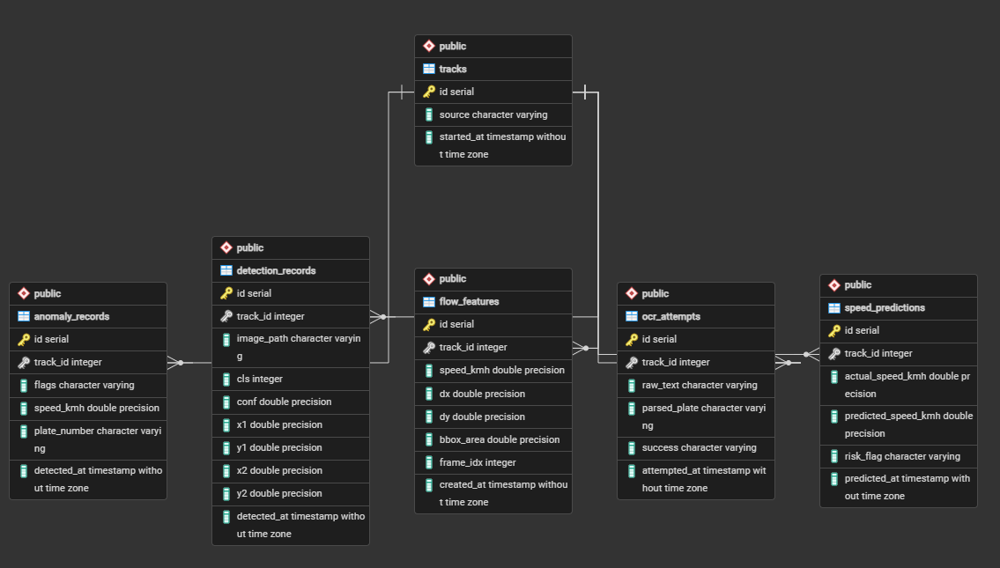

# 지능형 도로체계(ITS) — AI 기반 실시간 교통 이상탐지 시스템

## 한눈에 보기

CCTV 영상을 넣으면 → **차량을 검출·추적**하고 → **속도·방향을 계산**해서 → 정체·역주행·급정거·불법정차·과속 같은 **이상상황을 실시간으로 판정**한 뒤 → **DB에 기록**하고 **대시보드·지도에 표시**한다. 여기에 두 가지를 더 얹었다: 이상 차량의 **번호판을 자동 인식**하고, 최근 속도 흐름으로 **다음 순간의 급정거를 미리 예측**한다.

```
영상 → [검출] → [추적] → [속도·방향 계산] → [이상탐지 판정] ─┬→ [DB 저장] → [대시보드 + 카카오맵]
                                                              ├→ [번호판 검출·인식]
                                                              └→ [다음 속도 예측]
```

기술적으로는 **컴퓨터비전(YOLOv8) + 규칙기반/학습형 이상탐지(Isolation Forest) + 번호판 검출·인식(YOLOv8 파인튜닝+EasyOCR) + 회귀예측(RandomForest) + PostgreSQL + FastAPI + Chart.js + 카카오맵**을 하나의 파이프라인으로 엮은 프로젝트다. 아래는 그 안을 이루는 파일들의 상세 역할이다.

---

## 상세: 핵심 파이프라인 (src/)

| 파일 | 역할 | 단계 |
|---|---|---|
| `detect.py` | YOLOv8로 프레임에서 차량 검출 (승용차/트럭/오토바이/버스) | 2단계 |
| `tracker.py` | IOU 전역 최적 매칭으로 같은 차량에 고유 ID 부여 (프레임 간 추적) | 3단계 |
| `anomaly.py` | 과속·역주행·급정거·불법정차 판정 (규칙 기반, 양방향 도로 자동 캘리브레이션 포함) | 5단계 |
| `ml_anomaly.py` | Isolation Forest 기반 학습형 이상탐지 (정상 패턴에서 벗어난 흐름을 자동 탐지) | 6단계 |
| `ocr.py` | EasyOCR + 정규식으로 한국 번호판(숫자2~3+한글1+숫자4) 인식 | 7단계 |
| `plate_detect.py` | 학습된 전용 YOLO 모델로 차량 crop 안에서 번호판 "위치"만 정확히 검출 | 7단계 |
| `predict.py` | 최근 3프레임 속도로 다음 속도를 예측, 급정거 사전 경고 | 예측 확장 |
| `db.py` | PostgreSQL 스키마 정의 및 저장/조회 함수 전체 | 전체 |
| `api.py` | FastAPI 서버 — 대시보드용 REST API (GET 조회 + POST 저장) | 8단계 |
| `main.py` | 전체 파이프라인 실행 진입점 (영상 → 검출 → 추적 → 이상탐지 → DB) | 4단계 |
| `data_setup.py` | Kaggle 데이터셋 다운로드 |  |

## 상세: 실행/학습 스크립트 (최상위)

| 파일 | 역할 |
|---|---|
| `populate_db.py` | `data/raw` 이미지 전체를 검출해서 DB에 채움 |
| `populate_flow_features_demo.py` | Isolation Forest 학습 파이프라인 검증용 가상 데이터 생성 |
| `populate_anomaly_demo.py` | 대시보드 확인용 가상 이상탐지 데이터 생성 |
| `train_isolation_forest.py` | flow_features로 Isolation Forest 학습 → `models/isolation_forest.pkl` |
| `train_speed_predictor.py` | flow_features로 속도 예측 모델 학습 → `models/speed_predictor.pkl` (MAE 5.56km/h) |
| `batch_compare.py` | 여러 영상을 일괄 처리하고 차량수·평균속도·이상유형을 비교표로 출력 (이벤트 건수 vs 고유 차량 수 구분) |
| `inspect_plate_classes.py` | 원본 데이터셋 라벨의 클래스 번호별 샘플 이미지를 저장해, 어느 번호가 "번호판"인지 육안 확인 |
| `build_plate_dataset.py` | 번호판 클래스만 골라 단일클래스 YOLO 학습 데이터셋(train/val)으로 재구성 |
| `train_plate_detector.py` | 번호판 위치 검출 전용 YOLOv8n 학습 → `models/plate_detector.pt` (`--resume`로 중단된 학습 이어가기 지원) |
| `extract_plate_frames_from_videos.py` | 실제 영상에서 확신도 높게 검출된 번호판 프레임을 준지도학습 방식으로 추출해 학습 데이터 증강 |

## 상세: 단위테스트 (최상위, 실제 영상 없이 로직 검증용)

| 파일 | 검증 대상 | 결과 |
|---|---|---|
| `test_tracker.py` | 추적 ID가 프레임 간 유지되는지 | PASS |
| `test_anomaly.py` | 4개 이상탐지 규칙 + 오탐 방지 | 7/7 PASS |
| `test_ocr.py` | 합성 번호판 이미지로 OCR 인식 (원인 진단용 read_debug 포함) | 부분 성공 (실전 검증용) |
| `test_predict.py` | 속도 예측 로직 (급정거 위험 판정) | PASS |

## 상세: DB 구조 (PostgreSQL)



```
tracks (차량 추적 세션 원본, 위경도 포함 — 카카오맵 표시용)
 ├─ detection_records  (원본 검출 결과: 클래스, 신뢰도, 좌표)
 ├─ flow_features      (프레임별 속도·이동방향 — 학습 데이터)
 ├─ anomaly_records    (이상탐지 결과: 유형, 속도, 번호판)
 ├─ ocr_attempts        (번호판 인식 시도 기록: 성공/실패)
 └─ speed_predictions   (속도 예측 결과: 예측치, 위험여부)
```
모든 테이블이 `tracks.id`를 외래키(FK)로 참조 — 참조 무결성 보장.

## 상세: 대시보드 (static/dashboard.html)
- 신호등 색 체계(정상=초록, 위험=빨강)로 실시간 상태 배너 표시
- **카카오맵**으로 CCTV 위치와 이상탐지 발생 지점을 지도 위 마커로 표시
- Chart.js로 차종별/이상유형별/인식률/예측위험률 시각화
- GET(5초 자동 조회) + POST(버튼으로 즉시 데이터 생성) 둘 다 동작
- 번호판 인식 "성공 사례" 전용 테이블 — 실패가 많이 쌓여도 성공 사례가 항상 보이도록 별도 조회

## 상세: 번호판 인식 파이프라인 (7단계)
```
Kaggle 데이터셋의 number_plate 라벨 재활용
  → 클래스 확인(inspect_plate_classes.py)
  → 단일클래스 데이터셋 구성(build_plate_dataset.py)
  → YOLOv8n 학습(train_plate_detector.py, mAP50 0.925)
  → main.py가 이상탐지된 차량에 한해 자동으로 번호판 위치 검출 + OCR 시도
  → 실제 영상에서 확신도 높은 프레임을 재추출해 데이터 증강(extract_plate_frames_from_videos.py)
```
5개 실전 영상 시행착오 끝에 근접 촬영 조건에서 실제 인식 성공 확인 (상세: `docs/번호판인식_시행착오기록.docx`).

## 실행 방법

```bash
# 환경 설정 (Python 3.11 권장 — 3.14는 일부 패키지 사전빌드 파일 없음)
conda create -n its python=3.11 -y
conda activate its
pip install -r requirements.txt

# DB 초기화
set ITS_DB_PASSWORD=본인비밀번호
python -c "import sys; sys.path.append('src'); from db import init_db; init_db()"

# 파이프라인 실행 (영상)
cd src
python main.py --video ..\data\raw\sample.mp4

# 서버 실행 (최상위 폴더에서)
cd ..
uvicorn src.api:app --reload --port 8000
# 브라우저: http://localhost:8000/static/dashboard.html
```

## 개발 단계 체크리스트
- [x] 1단계: 데이터 수집 (Kaggle, 823장)
- [x] 2단계: 차량 검출 모델 (YOLOv8s)
- [x] 3단계: 추적 로직 (IOU 전역매칭)
- [x] 4단계: 이동 벡터/속도 산출 (5프레임 스무딩)
- [x] 5단계: 이상탐지 규칙 설계 (7/7 단위테스트 PASS, 실전 오탐 개선 완료)
- [x] 6단계: 학습형 이상탐지 (Isolation Forest, 실데이터 학습 예정)
- [x] 7단계: 번호판 인식 연동 (전용 모델 학습 mAP50 0.925, 실전 성공 사례 확보)
- [x] 8단계: 대시보드/API (GET+POST, Chart.js, 카카오맵)
- [ ] 9단계: 발표자료 정리
- [x] 부가: 간이 속도 예측 모델 (MAE 5.56km/h)

## Git 커밋 컨벤션
| 접두사 | 용도 |
|---|---|
| `feat:` | 새 기능 추가 |
| `fix:` | 버그 수정 |
| `docs:` | 문서 수정 |
| `refactor:` | 리팩토링 |
| `test:` | 테스트 추가 |
| `chore:` | 설정/잡일 |

## 트러블슈팅 기록
개발 중 겪은 문제와 해결 과정은 `docs/ITS_작업로그_*.docx`에 날짜별로 정리되어 있음.
주요 사례: Python 3.14 사전빌드 이슈, DB 세션 DetachedInstanceError, 양방향 도로 역주행 오탐, UTC/KST 시간대 오차 등.
